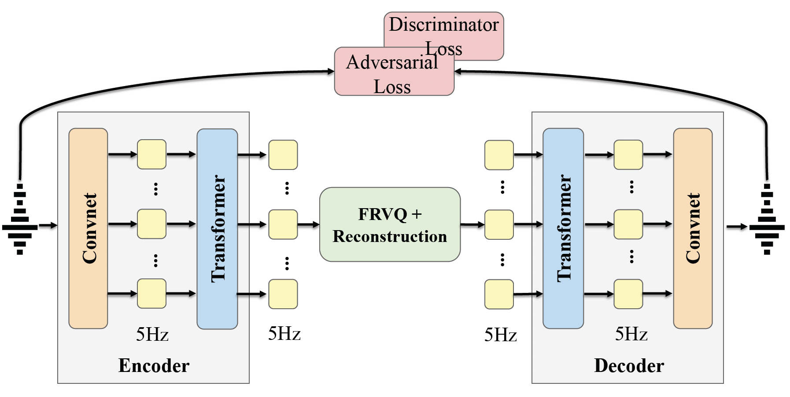

# U-Codec: Ultra Low Frame-rate Neural Speech Codec for Fast High-fidelity Speech Generation

[](https://yangxusheng-yxs.github.io/U-Codec/)
[](https://github.com/YangXusheng-yxs/CodecFormer_5Hz)
[](https://huggingface.co/shaunxsyang/U-Codec)


### News
This paper is currently under review. We have released the checkpoint of U-Codec (5Hz), which can be directly used for inference.


### To do list
- Provide the full training code for the U-Codec framework.

- Release the public code of the TTS models built on top of U-Codec.

If you are interested in U-Codec, feel free to contact us!
## Overview

We propose **U-Codec**, an **U**ltra low frame-rate neural speech **Codec** that achieves high-fidelity reconstruction and fast generation via an extremely frame-rate at 5Hz (5 frames per second). 
Extreme compression at 5Hz typically leads to severe intelligibility and spectral detail loss, we overcome this by integrating a Transformer-based inter-frame long-term dependency module and systematically optimizing residual vector quantization (RVQ) depth and codebook size. 
Moreover, we apply U-Codec into a large language model (LLM)-based auto-regressive TTS model, which leverages global and local hierarchical architecture to effectively capture dependencies across multi-layer tokens. 

The overview of U-Codec as following picture shows.



## How to inference U-Codec
We provide an example to demonstrate how to run U-Codec (5Hz) for audio tokenization and reconstruction.
### Environment Setup
First, create a Python environment following a similar setup to [project page](https://github.com/yangdongchao/UniAudio).
```
conda create -n ucodec python=3.8
conda init
source ~/.bashrc
conda activate ucodec
```
Then:
```
cd U-Codec
bash requirements.sh
```
### Run Inference
If you need pretrained weights, please download them on the [Checkpoint](https://huggingface.co/shaunxsyang/U-Codec).

We provide an example script AudioTokenizer_UCodec.py for tokenizing audio into discrete codes and reconstructing audio from the codes.

```
cd tools/tokenizer/soundstream
python AudioTokenizer_HY.py
```

You can directly use the released U-Codec 5Hz checkpoint for inference. More examples (e.g., TTS pipeline integration) will be released soon.


### Citation
If you find this code useful in your research, please cite our work and give us a star
```bib
@inproceedings{U-Codec,
  title     = {U-Codec: Ultra Low Frame-rate Neural Speech Codec for Fast High-fidelity Speech Generation},
  author    = {Xusheng Yang, Long Zhou, Wenfu Wang, Kai Hu, Shulin Feng, Chenxing Li, Meng Yu, Dong Yu, Yuexian Zou},
  booktitle = {arXiv},
  year      = {2025}
}
```

### Contact us
If you have any problem about the our code, please contact Xusheng (yangxs@stu.pku.edu.cn). 

### License
You can use the code under MIT license.
